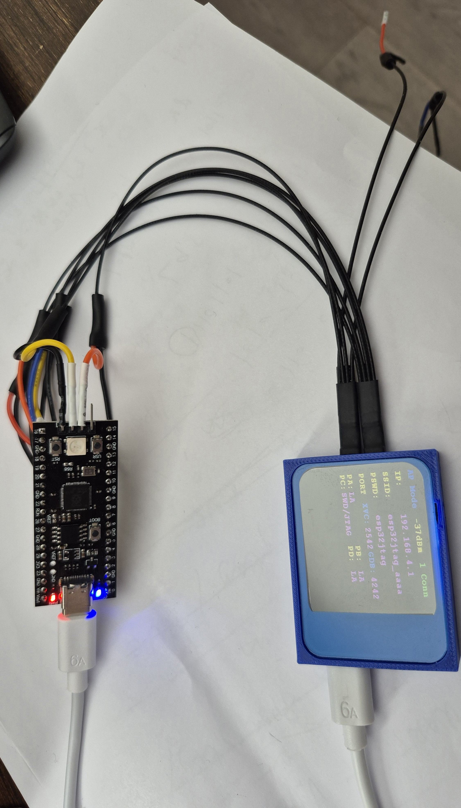
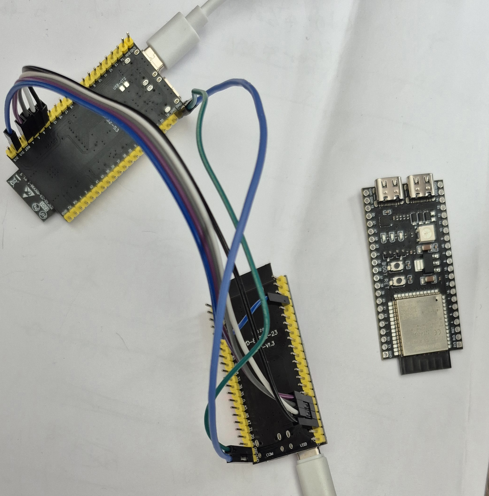
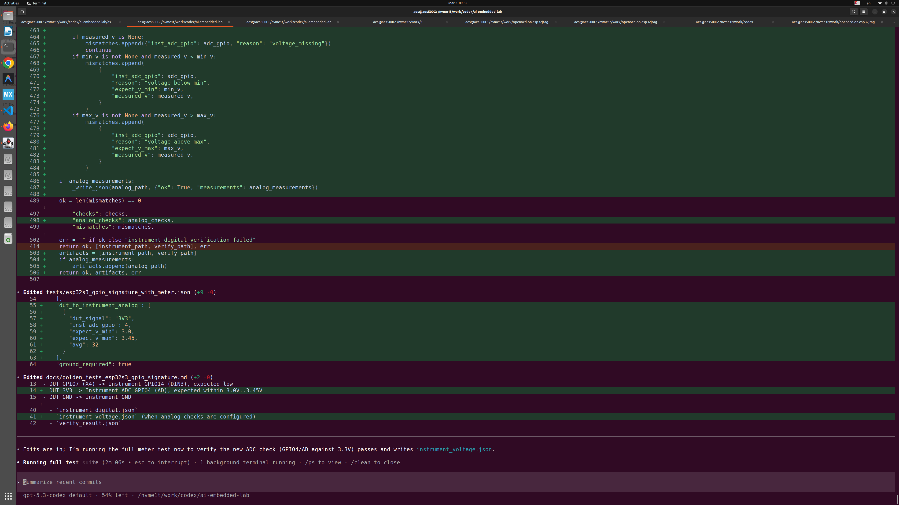

# AEL — AI-Driven Embedded Lab

What if embedded development could feel like **vibe coding**?

Instead of manually writing firmware, reading datasheets, wiring instruments, and debugging step by step, you can describe what you want in natural language — and the system helps design experiments, generate firmware, run tests on real hardware, and analyze the results.

AEL is an experimental system that brings **vibe coding to embedded systems**.

It connects AI reasoning with a real embedded hardware lab. The system can generate firmware, design experiments, flash MCUs, capture signals, and verify behavior automatically.

---

## 🚀 Installation and Getting Started

AEL is intentionally simple to install and easy to use.

1. Clone and set up the AEL repository.
2. Start an AI coding agent inside the repository, such as Codex or Claude Code.
3. Describe your goal in natural language.

That is the basic workflow.

You do not need to learn a large command surface before getting started. In the common case, you work inside the AEL repository with your AI agent and simply say what you want to do: bring up a board, generate firmware, run a test, investigate a failure, or validate a hardware feature. AEL provides the structure, assets, and command surface underneath, while the AI agent uses them to carry out the work.

This is one of AEL’s main advantages: it is powerful, but still easy to use. The experience is not centered on memorizing commands or manually stitching together tools. Instead, you install the repository, open an AI agent in that environment, and start working through natural language.

---

## Hardware

AEL is built for real hardware — but the barrier to entry is surprisingly low.

You can start with almost nothing:

- **ST-Link + an STM32 MCU/board** — a standard path, often just **$10–20 USD**
- **a single ESP32 dev board** — already enough to begin exploring AI-driven workflows
- **ESP32JTAG + a target board** — a next-gen, all-in-one instrument

---

### From "debug probe" → to "AI instrument"

Traditional tools like ST-Link do one thing well:
→ flash and debug

AI instrument like ESP32JTAG changes the model:

- **Wireless (WiFi)** — no cables, AI can access it over the network
- **Flash firmware**
- **Capture signals at high speed (~256 MHz in supported setups)**
- **Generate stimulus signals**
- **Interact with hardware in real time**

Instead of multiple lab tools, you get **one programmable, networked instrument**.

---

### Why this matters

This is not just cheaper hardware.

It changes how embedded systems are developed:

- The instrument becomes **AI-controllable**
- The workflow becomes **fully automated**
- Hardware is no longer "manual-only"

In many cases, a **single ESP32 device can replace an entire entry-level lab setup**.

---

You do not need expensive equipment to begin.

AEL is designed so that **real hardware + AI** becomes accessible, programmable, and scalable.

---

## 🤖 Natural-Language-First Usage

AEL is designed to be driven by AI. Instead of relying on manual command-by-command operation, you describe your goal to the AEL Agent, for example through Codex or Claude Code running inside the repository.

### Example 1: New Hardware Bring-up
**User:** “I have an STM32F411 Black Pill and an ST-Link. Can you help me run a smoke test?”  
**AEL Agent:** “I can use ST-Link as the flashing and debug interface for your F411. I’ll generate a minimal smoke test, flash it, and verify startup through a mailbox signal. Shall I proceed?”

### Example 2: Feature Validation
**User:** “Generate firmware for my RP2040 that toggles GPIO 16 at 1 kHz, then verify the frequency.”  
**AEL Agent:** “I will generate the RP2040 firmware, build it, flash it to your Pico, and then use the connected Instrument to capture and verify the 1 kHz signal on GPIO 16. I’ll report the measured frequency back to you.”

### Example 3: Debugging
**User:** “My UART loopback test is failing on the G431. Can you investigate?”  
**AEL Agent:** “I’ll check the UART configuration in the firmware, verify the physical loopback connections using the Connection Doctor, and then rerun the test with additional debug logging enabled.”

Instead of stopping at code generation, AEL allows AI and the engineer to collaborate: designing tests, debugging failures, and completing experiments using evidence from real hardware.

This project explores a future where AI becomes an active engineering partner in embedded development.

---

## 🚀 Latest Milestone

### STM32F407 Discovery — ST-Link + STM32 board support added (7/7 PASS, 2026-03-18)

AEL completed full bring-up and validation on STM32F407VGT6 Discovery using the onboard ST-Link V2 instrument path (USB → st-util GDB server → SWD).

**All 7 tests passed:**

- mailbox (basic run verification)
- timer interrupt (TIM3 at 100ms intervals, 10 interrupts for PASS)
- GPIO loopback (PB0 → PB1)
- UART loopback (USART2 PD5 → PD6, 115200 8N1)
- EXTI trigger (PB8 → PB9, 10 rising edges via SYSCFG routing)
- ADC loopback (PC0 → PC1, 12-bit, software-start)
- SPI loopback (PB15 MOSI → PB14 MISO, SPI2 master mode 0)

**Key notes:**

- Firmware generated by AI (bare-metal C, direct register access, no HAL). Zero human code written.
- Uses `monitor reset run` after `load` — st-util leaves target halted without it.
- USART2/PD5/PD6 used instead of USART1/PA9/PA10 — onboard ST-Link UART bridge occupies PA9/PA10.
- All 5 loopback jumpers placed once; no re-wiring between tests.

📄 [Full session record](docs/stm32f407_validation_session_record.md)
📄 [Smoke pack](packs/smoke_stm32f407.json)

---

### STM32H750 — Full Smoke Validation (7/7 PASS)

AEL successfully completed full bring-up and validation on STM32H750.

**All tests passed:**

- minimal_runtime_mailbox
- wiring_verify
- adc_dac_loopback
- gpio_loopback
- uart_loopback
- exti_trigger
- pwm_capture

### What this proves

- Autonomous firmware generation and execution
- Multi-domain validation (digital, analog, timing, interrupt, communication)
- Real hardware debugging and strategy adaptation
- Rule extraction from failures

👉 This marks the first full autonomous bring-up on STM32H7-class MCU.

### Key Insight

The primary bottleneck has shifted from software to physical wiring.

→ Next phase: reconfigurable socket + FPGA routing fabric

---

📄 [Full postmortem](docs/methodology/stm32h750_milestone_postmortem_v0_1.md)
📄 [Smoke pack](packs/smoke_stm32h750.json)

---

### STM32G431 — Full Smoke Validation (9/9 PASS)

AEL completed full bring-up and validation on STM32G431CBU6.

**All tests passed:**

- minimal_runtime_mailbox
- gpio_signature
- uart_loopback
- spi
- adc
- capture
- exti
- gpio_loopback
- pwm

**Key fixes during bring-up:**

- SPI: `CR2.FRXTH=1` required to lower RXNE threshold to 8-bit (G4 FIFO, not present on F4)
- ADC: `ADC12_CCR.CKMODE=01` required to select synchronous clock (async default needs PLL)

👉 First board to use the `minimal_runtime_mailbox` Step 0 debug-path gate as part of the pack.

📄 [Full postmortem](docs/methodology/stm32g431_milestone_postmortem_v0_1.md)
📄 [Smoke pack](packs/smoke_stm32g431.json)

---

### STM32F411 / STM32F401 — Verified (8/8 PASS)

AEL completed full bring-up on both STM32F4-family boards.

**STM32F411CEU6 (Black Pill)** and **STM32F401RCT6** — 8 experiments each:

- gpio_signature
- uart_loopback
- spi
- adc
- capture
- exti
- gpio_loopback
- pwm

These boards established the reference bring-up template used for all subsequent targets.

📄 [STM32F411 board doc](docs/boards/stm32f411ceu6.md)
📄 [STM32F401 board doc](docs/boards/stm32f401rct6.md)
📄 [F411 smoke pack](packs/smoke_stm32f411.json) | 📄 [F401 smoke pack](packs/smoke_stm32f401.json)

---

### STM32F407 Discovery — Smoke Pack Baseline (7/7 PASS, ST-Link)

AEL includes a fully validated STM32F407 Discovery smoke pack using ST-Link (st-util).

**Run:**

```bash
python3 -m ael pack --pack packs/smoke_stm32f407.json --board stm32f407_discovery
```

**Coverage — 7 tests:**

- mailbox (basic run verification)
- timer interrupt (TIM3)
- GPIO loopback (PB0 → PB1)
- UART loopback (USART2 PD5 → PD6)
- EXTI trigger (PB8 → PB9)
- ADC loopback (PC0 → PC1)
- SPI loopback (PB15 → PB14)

**Wiring:**

```
PB0  -> PB1
PD5  -> PD6
PB8  -> PB9
PC0  -> PC1
PB15 -> PB14
```

**Notes:**

- On STM32F4 Discovery, avoid PA9/PA10 for UART loopback — the onboard ST-Link UART bridge circuit causes interference. Use USART2 PD5/PD6 instead.
- When using st-util, GDB `load` does not start execution automatically. The board config includes `monitor reset run` to handle this.

This pack is fully validated (7/7 PASS) and serves as the regression baseline for STM32F407 + ST-Link in AEL.

📄 [Baseline document](docs/methodology/smoke_stm32f407_baseline_v0_1.md)
📄 [Smoke pack](packs/smoke_stm32f407.json)

---

## What AEL can do

AEL can automatically:

✔️ Generate firmware
✔️ Install toolchains (if missing)
✔️ Build projects
✔️ Flash target MCUs
✔️ Monitor UART logs
✔️ Detect crashes (panic / watchdog / reboot loops)
✔️ Capture and verify GPIO signals

All as part of a single automated pipeline.

---

## Why AEL?

Embedded development still relies heavily on manual iteration:

build → flash → observe → debug → repeat

AEL closes this loop using:

- AI-assisted project generation
- automated build & flash
- runtime monitoring
- hardware signal verification

And it works on **real hardware**, not simulations.

---

## How it works (Simplified)

```
Human → Orchestrator → Instrument → DUT (Target MCU)
```

Where:

- **Orchestrator** orchestrates the workflow and makes decisions
- **Instrument** provides debug access and signal capture
- **DUT** runs real firmware and produces observable behavior

---

## Example

Imagine:

- You have an STM32 board
- Its SWD is connected to an Instrument that supports Cortex MCU flash
- Its GPIOs P4–P7 are connected to capture inputs

You tell AEL:

> Generate firmware that outputs four different frequencies on P4–P7,
> build it, flash it, run it,
> and verify the signals are present.

AEL will:

1. Generate firmware
2. Build it
3. Flash the target
4. Run it
5. Capture signal behavior
6. Validate the result
7. Report PASS / FAIL

No manual intervention required.

---

## Reference Instrument: [ESP32JTAG](https://www.crowdsupply.com/ez32/esp32jtag)

AEL works with programmable **Instruments** that provide:

- debug access
- signal capture
- runtime monitoring

Today, **ESP32JTAG** serves as the first fully-supported Instrument.

It enables AEL to:

- flash firmware
- capture GPIO signals
- monitor UART output
- verify real hardware behavior

AEL itself is not tied to any specific hardware. [ESP32JTAG](https://www.crowdsupply.com/ez32/esp32jtag) is simply the first concrete implementation of the AEL Instrument concept.

---

## Try AEL with Two Dev Boards (No Dedicated Hardware Required)

You don't need [ESP32JTAG](https://www.crowdsupply.com/ez32/esp32jtag) to experience AEL.

A minimal setup uses:

- One ESP32-S3 dev board (Instrument)
- One RP2040 or STM32 or ESP32 dev board (DUT)

Total cost: under $20–$30.

The first board is a WiFi-based signal instrument that captures signals from the DUT or generates stimulus signals, and communicates with the Orchestrator over WiFi.

This allows AEL to build firmware, flash the target, run code, and verify signal behavior — without specialized hardware.

### Example Setup

Connect:

- ESP32 GPIO A → RP2040 IN0
- ESP32 GPIO B → RP2040 IN1
- ESP32 GPIO C → RP2040 IN2
- ESP32 GPIO D → RP2040 IN3
- GND → GND

Then tell AEL:

> Generate firmware with four different output frequencies,
> build it, flash it, run it, and verify signals.

AEL will compile, flash, run, measure, and validate automatically.

### Capability Comparison

| Setup | Auto Build | Flash | UART Monitor | Signal Verify |
|---|---|---|---|---|
| ESP32 only | ✔️ | ✔️ | ✔️ | ❌ |
| + RP2040 / STM32 | ✔️ | ✔️ | ✔️ | ✔️ |
| ESP32JTAG | ✔️ | ✔️ | ✔️ | ✔️ (higher speed & stability) |

---

## Some Use Case Examples

Here is an example using [ESP32JTAG](https://www.crowdsupply.com/ez32/esp32jtag) as Instrument with an RP2040 Pico board:



Another example uses two ESP32-S3 boards — one as Instrument to check GPIO levels, toggling, and target voltage; the other as DUT:



A screenshot showing AEL and Codex running together on Ubuntu:



---

## Supported Targets (v0.1)

- RP2040
- STM32F103
- STM32F411
- ESP32-S3

And much more to come.

---

## Verified Boards

Boards that have completed full bring-up and sequential verification on real hardware.

| Board | MCU | Family | Experiments | Status | Doc |
|-------|-----|--------|-------------|--------|-----|
| STM32F407 Discovery | STM32F407 | STM32F4 | 7 | verified (ST-Link) | [docs/methodology/smoke_stm32f407_baseline_v0_1.md](docs/methodology/smoke_stm32f407_baseline_v0_1.md) |
| STM32F411CEU6 (Black Pill) | STM32F411 | STM32F4 | 8 | verified | [docs/boards/stm32f411ceu6.md](docs/boards/stm32f411ceu6.md) |
| STM32F401RCT6 | STM32F401 | STM32F4 | 8 | verified | [docs/boards/stm32f401rct6.md](docs/boards/stm32f401rct6.md) |
| STM32G431CBU6 | STM32G431 | STM32G4 | 9 | verified | — |
| STM32H750VBT6 YD | STM32H750 | STM32H7 | 7 | verified | — |
| RP2040 Pico | RP2040 | RP2 | — | verified | — |
| ESP32-C6 DevKit | ESP32-C6 | ESP32 | — | verified | — |

---

## Terminology

An AEL lab consists of four core roles: Orchestrator, DUT, Instrument, Connections.

### Orchestrator

The system running AEL software. Typically a PC or server.

Responsible for:
- orchestration and decision making
- build & flash control
- verification logic

### DUT (Device Under Test)

The target system being developed or verified.

Examples:
- STM32 board
- RP2040 Pico
- ESP32-S3 target

Runs firmware and produces behavior.

### Instrument

A device that interacts with the DUT.

Instruments provide capabilities such as:

- debug access (SWD / JTAG)
- signal capture and generation
- UART monitoring
- measurement

Examples:
- [ESP32JTAG](https://www.crowdsupply.com/ez32/esp32jtag)
- RP2040 USB GPIO meter
- ESP32-S3 dev board (DIY instrument)
- External lab equipment

### Connections

Defines how DUTs are wired to Instruments.

Examples:

- SWD → Instrument Port P3
- DUT GPIO P4 → Capture IN0

Connections make automation reproducible.

### Together:

```
Orchestrator → Instruments → Connections → DUTs
```

---

## For AI Agents

See `docs/AI_USAGE_RULES.md` for CLI design rules and deterministic execution guidance.

---

## Latest Runs Helper

Use the helper script to quickly view the newest run folders and key logs:

```bash
tools/show_latest_runs.sh
tools/show_latest_runs.sh 3
```

It prints:

- latest run directories
- run status (`ok` / `fail`)
- key log paths (`preflight.log`, `build.log`, `flash.log`, `verify.log`)

---

## Workspace Cleanup

Use cleanup scripts to remove generated runs, artifacts, queue entries, reports, and cache files.

```bash
# Remove everything generated by AEL in this repo
tools/cleanup_workspce --full

# Preview what would be removed
tools/cleanup_workspce --full --dry-run

# Remove only entries older than a cutoff date/time
tools/cleanup_workspce 2026-03-06_15-10-59
tools/cleanup_workspce 2026-03-06
```

Notes:

- `tools/cleanup_workspce` is the compatibility alias (kept for existing usage).
- `tools/cleanup_workspace` is the canonical wrapper.
- `.gitkeep` placeholder files are preserved.

---

## Status

Early stage but actively used in daily development.

Feedback and contributions are welcome.

---

## Milestones

**v0.11-ai-loop** — AI-controlled hardware validation loop (2026-03-03)

AEL completed a full AI-driven hardware development loop using Codex:

- Generated a RunPlan
- Executed BUILD → LOAD → CHECK pipeline
- Flashed firmware to real hardware
- Captured UART logs and measured GPIO voltage
- Verified digital signature
- Detected a runtime failure, implemented a fix, re-ran the pipeline
- Achieved PASS on real hardware

**v0.11-autonomous-loop** — Autonomous development loop (2026-03-04)

AEL completed a full autonomous repository development cycle:

- Executed task queue sequentially
- Implemented minimal scoped changes
- Ran validation after every task
- Recorded task status with commit traceability
- Committed each completed step

Primary outputs: AIP HTTP instrument adapter, instrument manifest loader, AIP capability mapping, evidence writer helper, instrument contract validator.

---

## License

AEL is released under the [Apache 2.0 License](https://choosealicense.com/licenses/apache-2.0/).

You are free to:

- use it in personal projects
- integrate it into commercial products
- extend it for internal tooling

Third-party components and vendor code remain under their respective original licenses.
