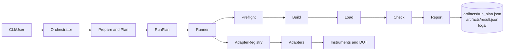
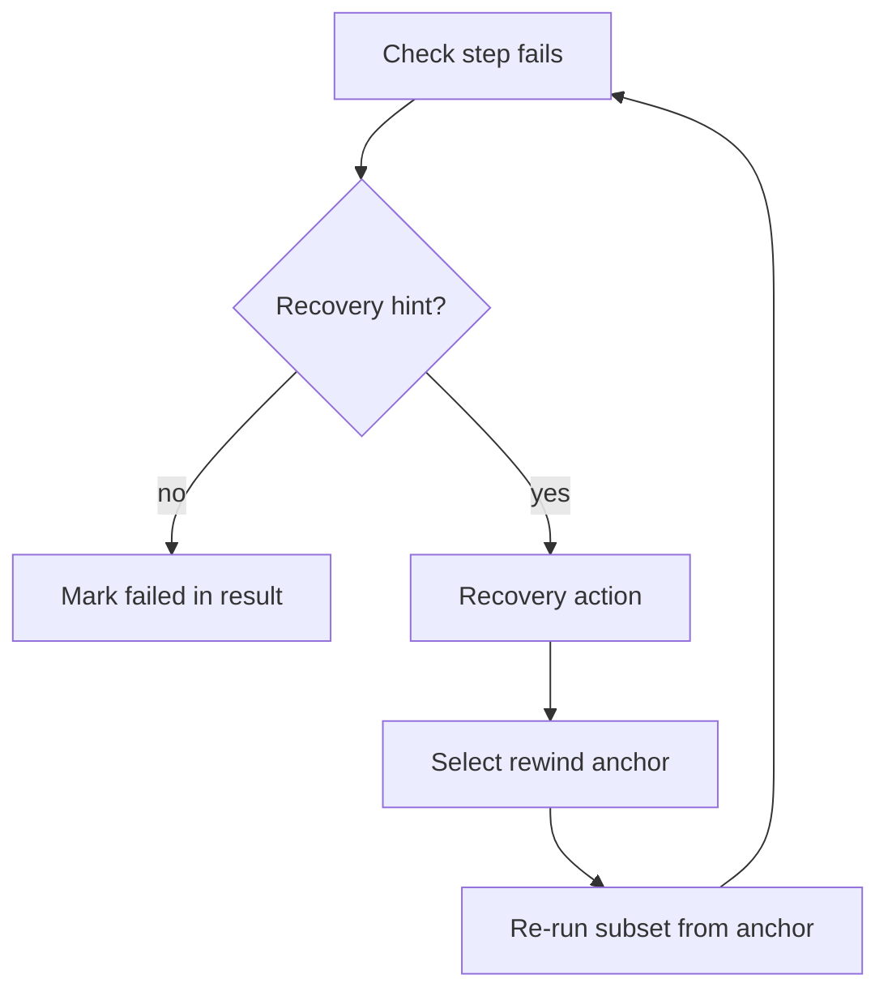

# AEL Architecture v0.1

This document is the single-source architecture reference for AEL v0.1.

## Top-level Runtime Blocks

Primary execution path:

`CLI -> Orchestrator -> RunPlan -> Runner -> AdapterRegistry -> Adapters -> Instruments/DUT`

Agent execution path:

`Queue -> Gate -> Execute -> Report`

## Runtime Data and Evidence

Evidence is produced under the run directory:

- `artifacts/run_plan.json`
- `artifacts/result.json`
- `logs/` (step and validation logs)

## Configuration Locations

Configuration sources used by orchestration/planning:

- `configs/boards/`
- `configs/probes/`
- instrument manifests (for example under `ael/instruments/`)

## Mermaid: Runtime Path

## Mermaid: Recovery Loop

## Agent Loop

The Agent repeatedly:

1. Reads tasks from queue inbox.
2. Runs gate checks for acceptance policy.
3. Executes the task RunPlan through Runner.
4. Writes artifacts and updates report output.

## Glossary

- **RunPlan**: The machine-readable intermediate representation that defines inputs, selected configs, ordered steps, and recovery policy.
- **Runner**: The hardware/tool-agnostic execution engine that runs RunPlan steps via adapters and writes result artifacts.
- **Gate**: A deterministic acceptance check (for example guard/smoke/hardware checks) that returns structured status.
- **HUMAN_ACTION_REQUIRED**: A non-code blockage (permission/device/manual intervention) that should be surfaced clearly without poisoning core automation by default.
